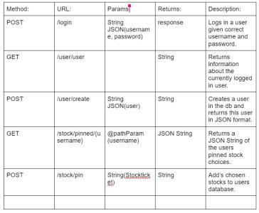

This is an API with the purpose of procuring and showing the information about stocks.

Overview of the different endpoints used through the backend which shows methods (POST, GET, PUT, DELETE), URL’s, Params, Returns plus a Description of each:

The typical flow of the api:
Firstly a client must be logged in to access most of the functionality of the app.
This is achieved after successfully creating an account, which can be done using the create user/create endpoint.
When successfully created, a client will be able to pin certain stocks (via the pinned endpoint) which will be saved and available at all times. The client will be able to view more detailed information about the stock when pinned (via the stock/pinned endpoint).
